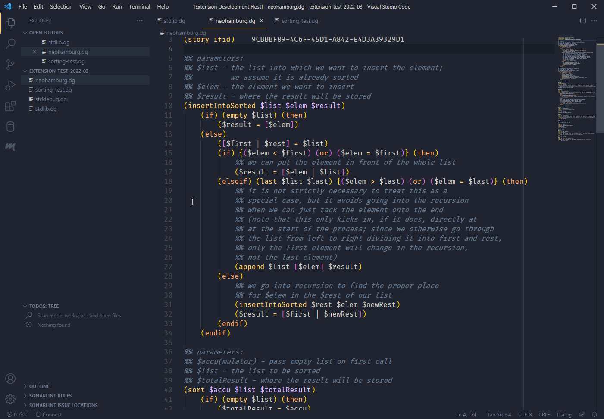

# Dialog Language Support

This extension adds some support for the **Dialog** language, which is used to create interactive fiction (text adventures). Dialog was created by Linus Åkesson and can be found at <https://linusakesson.net/dialog/>.

## Features

* syntax highlighting

* bracket matching & autoclosing

* toggling comments (to comment swathes of code in/out) (`Ctrl+#`)

* automatic indentation after certain keywords -- `(if, then, else, elseif)` -- and de-indentation after `(endif)`

* folding option: folds sections which begin when a line starts with `#` and which end when a line starts with `%%%`

### Compiling from VS Code

In the file explorer panel, right-click on the `.dg` file you want to compile, and select `Compile to zblorb` (or `z8` etc.) from the context menu.

**Or:** select `Terminal -> Run Task ...` from the menu bar and choose the compilation target.

**Or:** press `Ctrl+Shift+B` (or from the menu: `Terminal -> Run Build Task...`) and choose which compilation target will be regarded as the default one.

Compiler warnings and errors will be shown in the "Problems" tab, and you can click on them to jump to the corresponding line.

**Note:** for compilation, the extension assumes that the compiler `dialogc` is accessible on your system via your PATH environment variable. If that is not the case (or if you want to try out a new experimental compiler version, for example), then you can provide the full path to the compiler executable in the extension settings.

## Extension Settings

This extension contributes the following settings:

* `dialog.compiler`: Set the compiler executable that shall be used for compiling.
* `dialog.includeWhenCompiling`: List all `.dg` files that shall be included when compiling, separated only by commas, in the intended order (for example: `stddebug.dg,stdlib.dg`). (Except for the `.dg` file that is currently open in the editor, as that will be prepended automatically.) The default is just the Standard Library: `stdlib.dg`.

## Screenshots

**Syntax highlighting example (the colour theme is [Material Theme High Contrast](https://marketplace.visualstudio.com/items?itemName=Equinusocio.vsc-material-theme)):**

**Code folding (the colour theme is [Ayu Mirage Bordered](https://marketplace.visualstudio.com/items?itemName=teabyii.ayu)):**

**Compilation from context menu (the colour theme is [Material Theme High Contrast](https://marketplace.visualstudio.com/items?itemName=Equinusocio.vsc-material-theme)):**

**Compiler warning, jump to the line from the "Problems" tab (the colour theme is [Material Theme High Contrast](https://marketplace.visualstudio.com/items?itemName=Equinusocio.vsc-material-theme)):**

## NOT implemented

The extension does not implement intelligent autocomplete, tooltips/hover information, interaction with the debugger and other advanced features.

## Release Notes

### 1.0.0 - 2019-09-13

Initial release.

## License

Copyright (c) 2019 Michael Lauenstein. Released under the MIT License (see LICENSE).
